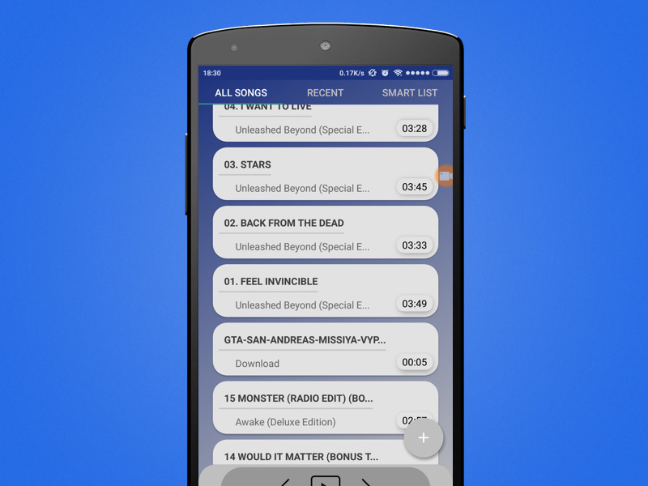
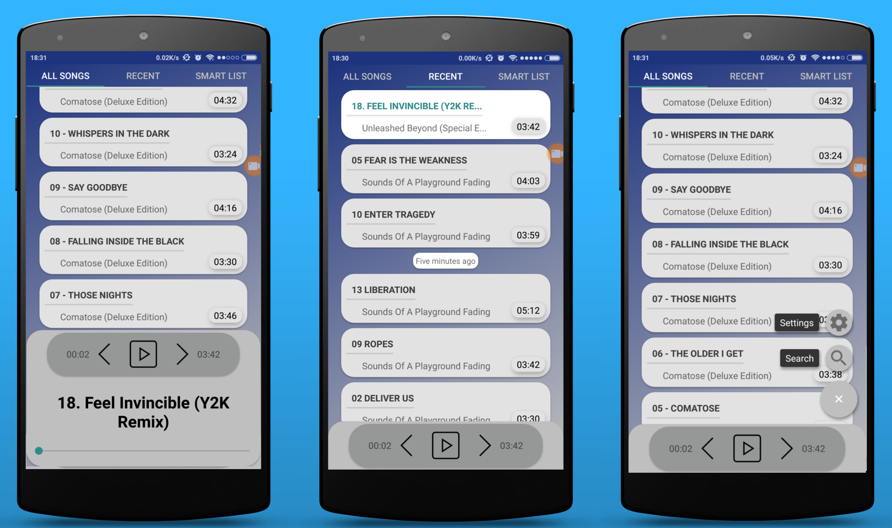
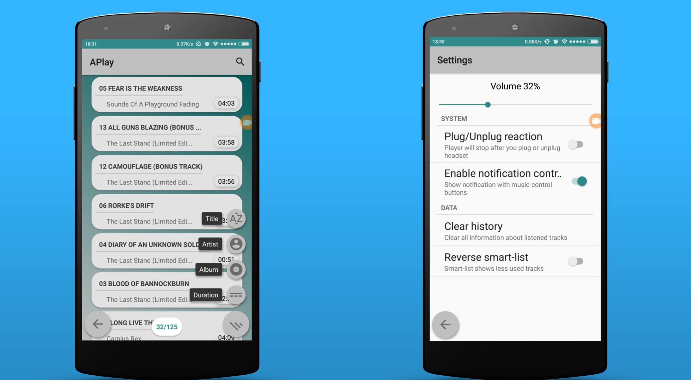
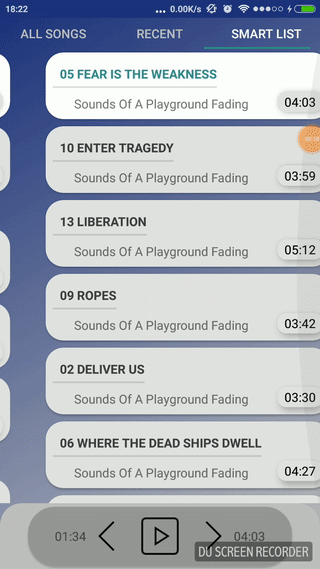
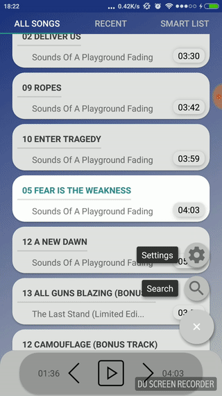

	

		
	

	<h2 align="center"><b>APlay</b></h2>
	<h4 align="center">Music player for android</h4>

## Description

* Lightweight app
* Fresh downloaded songs always on top
* Sorting by popularity, recent played
* Quick search by duration, title, artist name, album name
* Plug/Unplug reaction on headphones
* Notification music-cotroller

	
	
	

